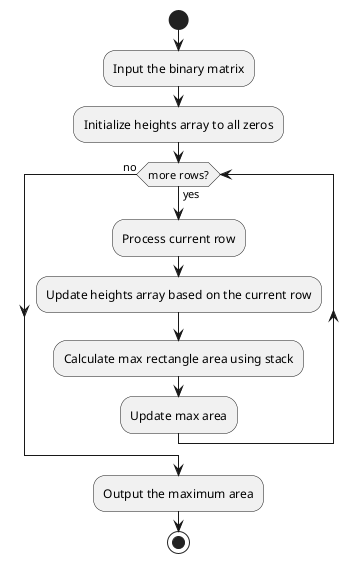

# Requirements
[85. Maximal Rectangle](https://leetcode.com/problems/maximal-rectangle/description/)
`dynamic programming`
# Analysis

This solution involves using a histogram technique for each row of the matrix
1. **Transform each row into a histogram**: Each cell in a row will represent the number of consecutive 1's seen so far in that column up to the current row.
2. **Calculate maximum area in histogram for each row**: For each transformed row, calculate the maximum area of a rectangle that can be formed in the histogram. This can be done using a stack to keep track of columns.

# Solution
## Explanation
The solution to the "Maximal Rectangle" problem is based on the idea of converting each row of the matrix into a histogram of heights and then using a known technique to find the largest rectangle in a histogram. Here's a detailed explanation:

### Problem Recap:
Given a 2D binary matrix filled with `'0'` and `'1'`, the goal is to find the largest rectangle containing only `1`s and return its area.

### Key Insight:
We can think of each row in the matrix as the base of a histogram. As we move down the rows, the histogram builds up with the heights representing the number of consecutive `1`s up to that row for each column.

For example:
- If the current row is row `i`, and the column is `j`, the height of the histogram for column `j` at row `i` is the number of consecutive `1`s in that column from row `i` upwards.
- If `matrix[i][j] == '1'`, then `heights[j]` is incremented by `1` from the previous row.
- If `matrix[i][j] == '0'`, then `heights[j]` is reset to `0` because you can't have a rectangle of `1`s in that column.

Once we build the histogram for each row, we compute the largest rectangle in that histogram using a stack-based approach.

### Step-by-Step Solution:

1. **Initialize Variables**:
    - `maxArea`: This keeps track of the maximum rectangle area found so far.
    - `heights`: An array that represents the histogram heights for each column as we move through each row. Initially, all heights are `0`.

2. **Update Histogram Heights**:
    - For each row in the matrix, update the `heights` array. If `matrix[i][j] == '1'`, increase `heights[j]` by 1 (build up the histogram). If `matrix[i][j] == '0'`, reset `heights[j]` to `0` (because no rectangle can include that column for this row).

3. **Find the Largest Rectangle in Histogram**:
    - For each updated `heights` array (corresponding to a row), compute the largest rectangle area that can be formed in that histogram.
    - This is done using a **monotonic stack** approach:
        - The stack stores the indices of the columns, ensuring that heights in the stack are in non-decreasing order.
        - When we encounter a height shorter than the height represented by the index at the top of the stack, we "pop" from the stack and calculate the area of the rectangle formed by the popped height.
        - The width of the rectangle is determined by the distance between the next element in the stack (after popping) and the current element.

4. **Update Maximum Area**:
    - After processing each row, the area of the largest rectangle is updated in the `maxArea` variable. We keep track of the largest rectangle area found across all rows.

### Example Walkthrough:

Consider the matrix:
```
[
    {'1', '0', '1', '0', '0'},
    {'1', '0', '1', '1', '1'},
    {'1', '1', '1', '1', '1'},
    {'1', '0', '0', '1', '0'},
]
```

#### Row 1: `['1', '0', '1', '0', '0']`
- Histogram heights: `[1, 0, 1, 0, 0]`
- Compute the largest rectangle in this histogram: The largest rectangle has area `1`.

#### Row 2: `['1', '0', '1', '1', '1']`
- Histogram heights: `[2, 0, 2, 1, 1]` (building up from the previous row)
- Compute the largest rectangle in this histogram: The largest rectangle has area `3` (formed by heights at index 2, 3, and 4).

#### Row 3: `['1', '1', '1', '1', '1']`
- Histogram heights: `[3, 1, 3, 2, 2]`
- Compute the largest rectangle in this histogram: The largest rectangle has area `6` (from index 2 to 4, with height 2).

#### Row 4: `['1', '0', '0', '1', '0']`
- Histogram heights: `[4, 0, 0, 3, 0]`
- Compute the largest rectangle in this histogram: The largest rectangle has area `3`.

### Core Functions:

1. **`maximalRectangle`**:
    - This is the main function that initializes the `heights` array and iterates over each row of the matrix.
    - It calls the `largestRectangleArea` function for each row after updating the histogram heights.

2. **`largestRectangleArea`**:
    - This function computes the largest rectangle area in a histogram.
    - It uses a stack to efficiently find the maximum area by iterating through the histogram only once (O(n) time complexity for each row).

### Final Output:
After processing all rows, the maximum area is found to be `6`.

### Key Points:
- We convert each row into a histogram of heights.
- We use a stack-based algorithm to compute the largest rectangle in each histogram.
- The solution runs in `O(m * n)` time and uses `O(n)` space, making it efficient for large matrices.

This approach effectively breaks the problem down into manageable parts by leveraging a known algorithm for solving the largest rectangle in a histogram.
## Flow diagram


```go
package main

import "fmt"

// maximalRectangle function to find the area of the largest rectangle containing only 1's
func maximalRectangle(matrix [][]byte) int {
	if len(matrix) == 0 || len(matrix[0]) == 0 {
		return 0
	}

	// Initialize variables
	maxArea := 0
	rows := len(matrix)
	cols := len(matrix[0])

	// Create a height array to store the heights of columns
	heights := make([]int, cols)

	// Iterate through each row of the matrix
	for i := 0; i < rows; i++ {
		// Update the heights array for this row
		for j := 0; j < cols; j++ {
			if matrix[i][j] == '1' {
				heights[j]++
			} else {
				heights[j] = 0
			}
		}
		// Calculate the maximum rectangle area for this row
		maxArea = max(maxArea, largestRectangleArea(heights))
	}

	return maxArea
}

// Function to calculate the largest rectangle area in a histogram
func largestRectangleArea(heights []int) int {
	stack := []int{}
	maxArea := 0
	heights = append(heights, 0) // Add a sentinel value to process remaining elements in the stack

	for i := 0; i < len(heights); i++ {
		for len(stack) > 0 && heights[i] < heights[stack[len(stack)-1]] {
			h := heights[stack[len(stack)-1]]
			stack = stack[:len(stack)-1]
			width := i
			if len(stack) > 0 {
				width = i - stack[len(stack)-1] - 1
			}
			maxArea = max(maxArea, h*width)
		}
		stack = append(stack, i)
	}

	return maxArea
}

// Utility function to return the maximum of two integers
func max(a, b int) int {
	if a > b {
		return a
	}
	return b
}

func main() {
	// Test case
	matrix := [][]byte{
		{'1', '0', '1', '0', '0'},
		{'1', '0', '1', '1', '1'},
		{'1', '1', '1', '1', '1'},
		{'1', '0', '0', '1', '0'},
	}

	fmt.Println(maximalRectangle(matrix)) // Output should be 6
}
```
Let's break down the time and space complexity of the solution:

### Time Complexity:
1. **Outer Loop**: The outer loop iterates over each row in the matrix. Let the number of rows be `m` and the number of columns be `n`. So, this loop runs `m` times.

2. **Inner Loop for Updating Heights**: For each row, we update the `heights` array in an inner loop. This loop also runs `n` times (once for each column), resulting in a total time complexity of `O(m * n)` for updating the heights.

3. **Largest Rectangle Area in Histogram**: After updating the heights array, we compute the largest rectangle area in a histogram for each row using the `largestRectangleArea` function.
    - This function uses a stack-based approach to find the largest rectangle in `O(n)` time for each row.
    - In the worst case, each element is pushed and popped from the stack exactly once. Hence, the time complexity for this part is also `O(n)`.

4. **Overall Time Complexity**:
    - For each row, we update the heights in `O(n)` and compute the largest rectangle area in `O(n)`.
    - Therefore, for `m` rows, the overall time complexity is:
      \[
      O(m \times n) \text{ for updating heights} + O(m \times n) \text{ for calculating largest rectangle area}
      \]
      \[
      \text{Total Time Complexity} = O(m \times n)
      \]

### Space Complexity:
1. **Heights Array**: We maintain an array `heights` of size `n` (number of columns) to store the current histogram heights. The space required for this array is `O(n)`.

2. **Stack**: The stack used in the `largestRectangleArea` function also holds at most `n` elements at any point in time (each element corresponding to a column). Therefore, the space complexity for the stack is also `O(n)`.

3. **Overall Space Complexity**:
    - The overall space complexity is dominated by the space required for the `heights` array and the stack, which are both `O(n)`.
      \[
      \text{Total Space Complexity} = O(n)
      \]

### Summary:
- **Time Complexity**: `O(m * n)`
- **Space Complexity**: `O(n)`

Thus, this solution is efficient in terms of both time and space for the given problem.
