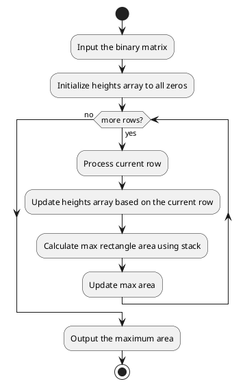

# Requirements
[85. Maximal Rectangle](https://leetcode.com/problems/maximal-rectangle/description/)
`dynamic programming`
# Analysis

This solution involves using a histogram technique for each row of the matrix
1. **Transform each row into a histogram**: Each cell in a row will represent the number of consecutive 1's seen so far in that column up to the current row.
2. **Calculate maximum area in histogram for each row**: For each transformed row, calculate the maximum area of a rectangle that can be formed in the histogram. This can be done using a stack to keep track of columns.

# Solution
## Flow diagram


```go
func maxHistogramArea(heights []int) int {
	stack := []int{}
	maxArea := 0
	index := 0

	for index < len(heights) {
		if len(stack) == 0 || heights[index] >= heights[stack[len(stack)-1]] {
			stack = append(stack, index)
			index++
		} else {
			topOfStack := stack[len(stack)-1]
			stack = stack[:len(stack)-1]
			area := heights[topOfStack] * (index - 1 - (len(stack)-1))
			if len(stack) > 0 {
				area = heights[topOfStack] * (index - stack[len(stack)-1] - 1)
			}
			if area > maxArea {
				maxArea = area
			}
		}
	}

	for len(stack) > 0 {
		topOfStack := stack[len(stack)-1]
		stack = stack[:len(stack)-1]
		area := heights[topOfStack] * (index - 1 - (len(stack)-1))
		if len(stack) > 0 {
			area = heights[topOfStack] * (index - stack[len(stack)-1] - 1)
		}
		if area > maxArea {
			maxArea = area
		}
	}

	return maxArea
}

// Main function to find the largest rectangle containing only 1's in a binary matrix.
func maximalRectangle(matrix [][]string) int {
	if len(matrix) == 0 || len(matrix[0]) == 0 {
		return 0
	}

	maxArea := 0
	heights := make([]int, len(matrix[0]))

	for i := 0; i < len(matrix); i++ {
		for j := 0; j < len(matrix[0]); j++ {
			if matrix[i][j] == "0" {
				heights[j] = 0
			} else {
				heights[j] += 1
			}
		}
		currentArea := maxHistogramArea(heights)
		if currentArea > maxArea {
			maxArea = currentArea
		}
	}

	return maxArea
}
```
