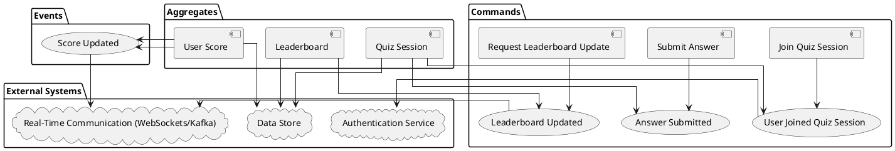

**Title:** "System Design Document for Real-Time Quiz Platform"  
**Subtitle:** "A comprehensive overview of the architecture and design considerations for a real-time quiz platform."  
**Presented by:** Nguyen Thanh Cong, Technical Lead  
**Date:** October 26, 2024

## Business requirements

### User Participation:

- Users should be able to join a quiz session using a unique quiz ID.
- The system should support multiple users joining the same quiz session simultaneously.

### Real-Time Score Updates:

- As users submit answers, their scores should be updated in real-time.
- The scoring system must be accurate and consistent.

### Real-Time Leaderboard:

- A leaderboard should display the current standings of all participants.
- The leaderboard should update promptly as scores change.

# Business Context for Real-Time Quiz Platform

### Overview
The proposed platform is an interactive quiz application designed to engage users in competitive knowledge-based contests. This system will cater to educational institutions, corporate training programs, and entertainment venues where real-time engagement and assessment are key.

### Core Features

#### User Participation
- **Quiz Session Access**: Users can join a quiz by entering a unique quiz ID, which they receive upon registration or invitation. This ID ensures that participants enter the correct session without unauthorized access.
- **Concurrent Participation**: The platform is engineered to handle multiple users joining and participating in the same quiz session simultaneously without any loss in performance, ensuring a smooth user experience for large groups.

#### Real-Time Score Updates
- **Instant Feedback**: As participants answer quiz questions, their scores are calculated and updated immediately. This feature aims to enhance user engagement by providing instant feedback on their performance.
- **Scoring Accuracy and Consistency**: The scoring system is built to be both accurate and consistent, employing algorithms that ensure fair scoring based on the difficulty of the questions and the accuracy of the responses.

#### Real-Time Leaderboard
- **Dynamic Leaderboard Display**: A live leaderboard will be prominently displayed during the quiz, showing the current standings of all participants. This feature fosters a competitive atmosphere and keeps users motivated.
- **Prompt Updates**: The leaderboard refreshes in real-time as scores change, ensuring that all participants have up-to-date information about their standing relative to others in the quiz.

### Technical Considerations
- **Scalability**: The backend infrastructure must support scalability to accommodate a high number of concurrent users, especially for large-scale implementations in schools or corporate environments.
- **Reliability**: High availability and minimal downtime are critical, ensuring that quiz sessions run smoothly and without interruption.
- **Real-Time Processing**: Implementing technologies like WebSocket for real-time bi-directional communication between the server and clients, ensuring that scores and leaderboard changes are transmitted instantly.

### Potential Use Cases
- **Educational Assessments**: Schools and universities can use the platform for conducting timed quizzes and tests, making learning interactive and engaging.
- **Corporate Training**: Companies can utilize the quizzes for training employees, assessing their knowledge retention in a dynamic and engaging manner.
- **Public Events**: Organizers of public events, like trivia nights or competitive gaming, can use this system to enhance participant interaction and enjoyment.

# Prequisites
| Tool             | Description                                                                                                                                                           | Main Uses                                                    | Strengths                                                      |
|------------------|-----------------------------------------------------------------------------------------------------------------------------------------------------------------------|--------------------------------------------------------------|----------------------------------------------------------------|
| **Event Storming** | An interactive and collaborative workshop format used for domain discovery and exploration by visualizing complex business domains through domain events.           | - Domain modeling<br>- Requirements gathering<br>- Process discovery | - Enhances collaboration across roles<br>- Quickly identifies domain complexities and inconsistencies |
| **PlantUML (PUML)**  | A tool that allows users to create diagrams from plain text descriptions, using a simple scripting language.                                                          | - Architecture diagrams<br>- Sequence diagrams<br>- Class diagrams | - Easy to use and version control<br>- Supports various diagram types<br>- Integrates with many development tools |

## Event Storming for Real-Time Quiz Platform

## Solution Architecture

## Context view

```puml
@startuml SystemContext
!define Rectangle class
!includeurl https://raw.githubusercontent.com/plantuml-stdlib/C4-PlantUML/master/C4_Context.puml

LAYOUT_WITH_LEGEND()

title System Context diagram for Quiz System

Person(user, "Quiz Participant", "A user participating in the quiz.")
System(quizSystem, "Quiz System", "Allows users to join quiz sessions, submit answers, and view a real-time leaderboard.")

user -> quizSystem : Joins quiz using unique ID
user -> quizSystem : Submits answers
user -> quizSystem : Views leaderboard

@enduml
```

## Container view

```puml
@startuml Containers
!define Rectangle class
!includeurl https://raw.githubusercontent.com/plantuml-stdlib/C4-PlantUML/master/C4_Container.puml

LAYOUT_WITH_LEGEND()

title Container Diagram for the Quiz System

Person(user, "Quiz Participant", "A user participating in the quiz.")
Container(apiGateway, "API Gateway", "API management", "Handles user requests for joining and participating in quizzes.")
Container(appSync, "AWS AppSync", "GraphQL Service", "Provides a flexible, scalable API for client-server interactions.")
Container(lambda, "AWS Lambda", "Serverless Function", "Executes business logic such as score calculation and session management.")
Container(dynamoDB, "DynamoDB", "NoSQL Database", "Stores user data, quiz questions, and scores.")
Container(eks, "EKS with App Mesh", "Container Orchestration", "Manages microservices for quiz management and leaderboards.")
Container(stepFunctions, "AWS Step Functions", "Function Orchestrator", "Coordinates state transitions and orchestrates microservices.")

Rel(user, apiGateway, "Uses")
Rel(apiGateway, appSync, "Routes API Calls")
Rel(appSync, lambda, "Triggers")
Rel(lambda, dynamoDB, "Reads/Writes Data")
Rel(lambda, eks, "Communicates for complex operations")
Rel(eks, dynamoDB, "Accesses for state management")
Rel(user, appSync, "Subscribes to updates via")
Rel(stepFunctions, lambda, "Manages execution flow of")

@enduml
```

## Component view

```puml
@startuml ScoringServiceComponent
!define Rectangle class
!includeurl https://raw.githubusercontent.com/plantuml-stdlib/C4-PlantUML/master/C4_Component.puml

LAYOUT_WITH_LEGEND()

title Component Diagram for Scoring Service in Clean Architecture

Container_Boundary(scoring_service, "Scoring Service") {
    Component(score_entity, "Score Entity", "Entity", "Holds core business logic related to quiz scoring.")
    Component(quiz_session_entity, "Quiz Session Entity", "Entity", "Manages quiz session information.")

    Component(calculate_score_use_case, "Calculate Score Use Case", "Use Case", "Processes score calculation based on user answers.")
    Component(update_leaderboard_use_case, "Update Leaderboard Use Case", "Use Case", "Updates the leaderboard data in real-time.")

    Component(scoring_controller, "Scoring Controller", "Interface Adapter", "API interface that handles incoming requests to submit answers.")
    Component(leaderboard_presenter, "Leaderboard Presenter", "Interface Adapter", "Prepares and sends leaderboard data to clients.")

    Component(dynamodb_adapter, "DynamoDB Adapter", "Framework & Driver", "Manages data storage and retrieval from DynamoDB.")
    Component(appsync_api, "AppSync API", "Framework & Driver", "Handles subscriptions and push updates to clients.")

    Rel(scoring_controller, calculate_score_use_case, "Calls")
    Rel(calculate_score_use_case, score_entity, "Uses")
    Rel(calculate_score_use_case, dynamodb_adapter, "Updates scores via")

    Rel(leaderboard_presenter, update_leaderboard_use_case, "Calls")
    Rel(update_leaderboard_use_case, quiz_session_entity, "Uses")
    Rel(update_leaderboard_use_case, dynamodb_adapter, "Fetches and updates leaderboard via")

    Rel(appsync_api, leaderboard_presenter, "Push updates to")
    Rel(dynamodb_adapter, score_entity, "Reads/Writes data for")
}

@enduml
```

### Infrastructure view

```puml
@startuml VocabularyQuizHighLevelArchitectureDiagram

' Link to AWS Architecture Blog (optional, for reference)
' https://aws.amazon.com/blogs/architecture/sequence-diagrams-enrich-your-understanding-of-distributed-architectures/

!define AWSPuml https://raw.githubusercontent.com/awslabs/aws-icons-for-plantuml/v18.0/dist
!include AWSPuml/AWSCommon.puml
!include AWSPuml/ApplicationIntegration/APIGateway.puml
!include AWSPuml/Compute/LambdaLambdaFunction.puml
!include AWSPuml/Database/DynamoDB.puml
!include AWSPuml/General/User.puml
!include AWSPuml/Groups/AWSCloud.puml
!include AWSPuml/NetworkingContentDelivery/CloudFront.puml
!include AWSPuml/NetworkingContentDelivery/CloudFrontEdgeLocation.puml

' Custom style and layout adjustments
hide stereotype
skinparam linetype ortho
skinparam rectangle {
    BackgroundColor AWS_BG_COLOR
    BorderColor transparent
    Shadowing false
}

!procedure $AWSIcon($service, $line1, $line2="")
rectangle "$AWSImg($service)\n<b>$line1</b>\n$line2"
!endprocedure

' Step number display configuration
!procedure $stepnum($number)
<back:black><color:white><b> $number </b></color></back>\n
!endprocedure

' Define components and their interactions
$AWSIcon(User, " ", "User") as user
AWSCloudGroup(cloud){
  $AWSIcon(CloudFront, "Web Distribution", "Amazon CloudFront") as cf
  user -r-> cf: $stepnum("1")

  $AWSIcon(CloudFrontEdgeLocation, "Origin Request", "AWS Lambda@Edge") as edge
  $AWSIcon(DynamoDB, "Version Mappings", "Amazon DynamoDB") as dynamodb
  edge -r-> dynamodb: $stepnum("3")
  cf -u-> edge: $stepnum("2")

  $AWSIcon(APIGateway, "API V1", "Amazon API Gateway") as api1
  $AWSIcon(LambdaLambdaFunction, "Function V1", "AWS Lambda") as lambda1
  edge -[hidden]d- api1
  dynamodb -[hidden]d- lambda1
  cf -r-> api1: $stepnum("4")
  api1 -r-> lambda1

  $AWSIcon(APIGateway, "API V2", "Amazon API Gateway") as api2
  $AWSIcon(LambdaLambdaFunction, "Function V2", "AWS Lambda") as lambda2
  cf -r-> api2
  api1 -[hidden]d- api2
  lambda1 -[hidden]d- lambda2
  api2 -r-> lambda2
}

@enduml
```
