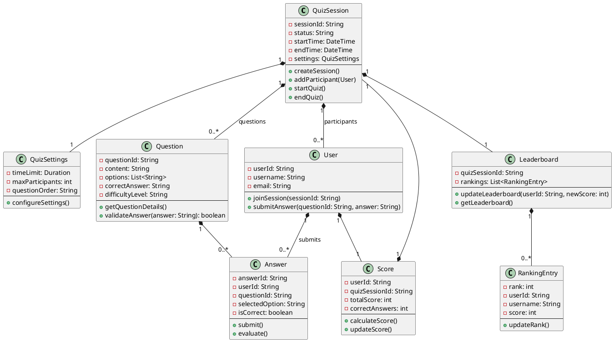
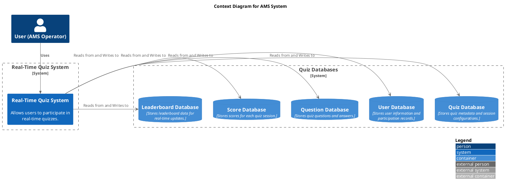
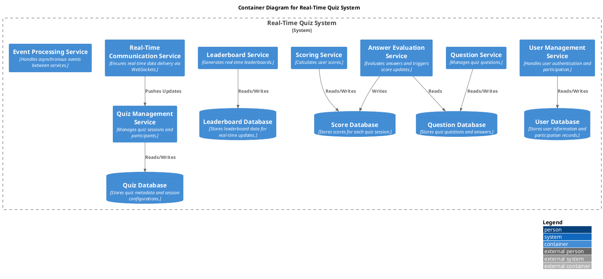
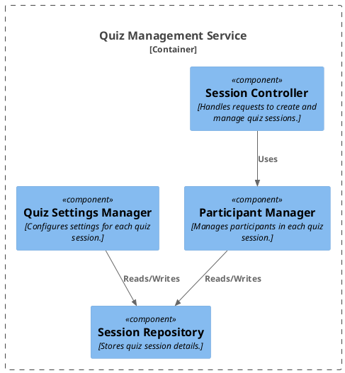
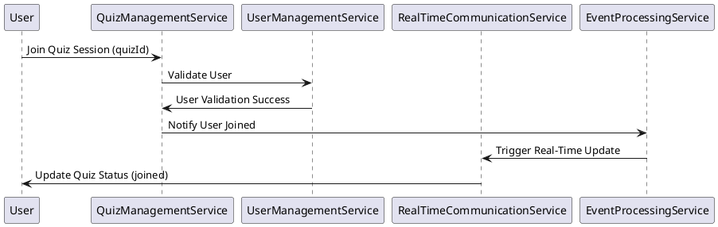

Event storming is a useful approach to understand and design a system by mapping out the various events, commands, aggregates, and policies. Let's break down the Real-Time Quiz feature using this technique:

### **Domain Events**
1. **Quiz Session Created**
    - Triggered when a new quiz session is initiated.
    - Includes details like quiz ID, time, and other session settings.

2. **User Joined Quiz**
    - Triggered when a user enters a quiz session using a unique quiz ID.
    - Includes user information and quiz session ID.

3. **Question Displayed to Users**
    - Triggered when a new question is made available to all participants in the quiz session.

4. **Answer Submitted**
    - Triggered when a user submits an answer.
    - Includes user ID, question ID, and the answer given.

5. **Score Updated**
    - Triggered when an answer is evaluated, and the user’s score is calculated and updated.
    - Includes user ID, question ID, and the new score.

6. **Leaderboard Updated**
    - Triggered when scores are updated, affecting the real-time leaderboard.
    - Includes the ranking information of all users in the quiz session.

### **Commands**
1. **Create Quiz Session**
    - Command to start a new quiz session.
    - Includes the necessary details to initialize the session.

2. **Join Quiz Session**
    - Command issued by users to join an existing quiz session.
    - Requires quiz ID for users to connect.

3. **Submit Answer**
    - Command used by participants to submit their answers.
    - Includes user ID, question ID, and the submitted answer.

4. **Display Next Question**
    - Command to present the next question to all users.
    - Usually issued after a timer ends or when all answers are submitted.

### **Aggregates**
1. **Quiz Session**
    - Manages the state of a quiz session, including the list of participants, current questions, and session status.

2. **User**
    - Manages user-specific details within a quiz session, such as scores and participation status.

3. **Leaderboard**
    - Keeps track of user scores and rankings, managing real-time updates.

### **Policies**
1. **Validate Quiz ID**
    - Ensures that a user can only join a quiz session if the quiz ID is valid and the session is open.

2. **Evaluate Answers**
    - Automatically checks the correctness of submitted answers and updates scores.

3. **Trigger Leaderboard Update**
    - Initiates an update to the leaderboard whenever a user’s score changes.

### **Process Flow**
1. **Quiz Creation and User Participation**
    - A host or system triggers the creation of a quiz session (`Quiz Session Created` event).
    - Users join using a unique ID, leading to `User Joined Quiz` events.

2. **Question Presentation and Answer Submission**
    - Questions are displayed to all users simultaneously (`Question Displayed to Users` event).
    - Users submit answers (`Answer Submitted` command), and the system evaluates them.

3. **Score Calculation and Leaderboard Update**
    - The system calculates scores (`Score Updated` event) based on correct answers.
    - Whenever scores are updated, the leaderboard refreshes in real-time (`Leaderboard Updated` event).

---

Based on the event storming analysis, the Real-Time Quiz feature can be split into several microservices. Each microservice will be responsible for handling a distinct part of the functionality, ensuring scalability, maintainability, and flexibility. Here's how the system can be decomposed:

### **1. Quiz Management Service**
- **Responsibilities:**
    - Create and manage quiz sessions.
    - Store details about each quiz (e.g., questions, timer settings, and configuration).
    - Handle user requests to join a quiz.
- **Key Events/Commands:**
    - `Create Quiz Session`, `Quiz Session Created`
    - `Join Quiz Session`, `User Joined Quiz`
- **Database:**
    - Stores quiz metadata, session configurations, and unique quiz IDs.

### **2. User Management Service**
- **Responsibilities:**
    - Manage user information and participation in quiz sessions.
    - Authenticate users and ensure valid quiz entry.
    - Track user status (active, disconnected, etc.) during the quiz.
- **Key Events/Commands:**
    - `User Joined Quiz`, `Validate Quiz ID`
- **Database:**
    - User profiles, quiz participation records.

### **3. Question Service**
- **Responsibilities:**
    - Manage questions, including fetching and presenting them to participants.
    - Control the flow of questions during the quiz (e.g., timing, order, etc.).
- **Key Events/Commands:**
    - `Question Displayed to Users`, `Display Next Question`
- **Database:**
    - Stores questions, answers, and associated metadata.

### **4. Answer Evaluation Service**
- **Responsibilities:**
    - Receive answers from users, evaluate them, and determine if they are correct.
    - Trigger score updates based on correct or incorrect answers.
- **Key Events/Commands:**
    - `Submit Answer`, `Answer Submitted`, `Evaluate Answers`, `Score Updated`
- **Database:**
    - Temporary storage for active questions and answers during a session.

### **5. Scoring Service**
- **Responsibilities:**
    - Calculate scores based on rules (e.g., correct answer points, time-based scoring, etc.).
    - Maintain and update real-time scores for each user.
- **Key Events/Commands:**
    - `Score Updated`
- **Database:**
    - Score records for each quiz session, user-specific score data.

### **6. Leaderboard Service**
- **Responsibilities:**
    - Generate and update the real-time leaderboard based on scores.
    - Push leaderboard updates to users in real-time.
- **Key Events/Commands:**
    - `Leaderboard Updated`, `Trigger Leaderboard Update`
- **Database:**
    - Stores leaderboard snapshots, rankings, and user scores.

### **7. Real-Time Communication Service**
- **Responsibilities:**
    - Manage WebSockets or server-sent events (SSE) to ensure real-time communication between clients and the system.
    - Push real-time updates for questions, scores, and the leaderboard to users.
- **Key Events/Commands:**
    - `Question Displayed`, `Score Updated`, `Leaderboard Updated`
- **Integration:**
    - Interacts with the Quiz Management, Question, Scoring, and Leaderboard services to push updates.

### **8. Event Processing Service**
- **Responsibilities:**
    - Handle asynchronous events between microservices.
    - Act as a message broker to decouple services and ensure event-driven architecture.
- **Tools:**
    - Kafka, RabbitMQ, or similar messaging systems.
- **Key Events:**
    - `User Joined Quiz`, `Answer Submitted`, `Score Updated`, `Leaderboard Updated`

### **Advantages of This Microservices Architecture**
1. **Scalability:** Each service can be scaled independently. For example, if there is a high load on the scoring service during peak times, it can be scaled up without affecting other parts of the system.
2. **Maintainability:** Isolating different functionalities into separate services simplifies updates and bug fixes.
3. **Resilience:** Failure in one service (e.g., leaderboard service) won't bring down the entire system, as other services can continue to operate.
4. **Flexibility:** Easy to extend or modify specific parts of the system (e.g., adding new types of quizzes or scoring rules) without affecting others.

---

### **Conceptual Class Diagram**

1. **QuizSession**
    - **Attributes:**
        - `sessionId: String`
        - `status: String` (e.g., active, completed)
        - `startTime: DateTime`
        - `endTime: DateTime`
        - `settings: QuizSettings`
    - **Methods:**
        - `createSession()`
        - `addParticipant(User)`
        - `startQuiz()`
        - `endQuiz()`

2. **QuizSettings**
    - **Attributes:**
        - `timeLimit: Duration`
        - `maxParticipants: int`
        - `questionOrder: String` (e.g., random, sequential)
    - **Methods:**
        - `configureSettings()`

3. **User**
    - **Attributes:**
        - `userId: String`
        - `username: String`
        - `email: String`
    - **Methods:**
        - `joinSession(sessionId: String)`
        - `submitAnswer(questionId: String, answer: String)`

4. **Question**
    - **Attributes:**
        - `questionId: String`
        - `content: String`
        - `options: List<String>`
        - `correctAnswer: String`
        - `difficultyLevel: String`
    - **Methods:**
        - `getQuestionDetails()`
        - `validateAnswer(answer: String): boolean`

5. **Answer**
    - **Attributes:**
        - `answerId: String`
        - `userId: String`
        - `questionId: String`
        - `selectedOption: String`
        - `isCorrect: boolean`
    - **Methods:**
        - `submit()`
        - `evaluate()`

6. **Score**
    - **Attributes:**
        - `userId: String`
        - `quizSessionId: String`
        - `totalScore: int`
        - `correctAnswers: int`
    - **Methods:**
        - `calculateScore()`
        - `updateScore()`

7. **Leaderboard**
    - **Attributes:**
        - `quizSessionId: String`
        - `rankings: List<RankingEntry>`
    - **Methods:**
        - `updateLeaderboard(userId: String, newScore: int)`
        - `getLeaderboard()`

8. **RankingEntry**
    - **Attributes:**
        - `rank: int`
        - `userId: String`
        - `username: String`
        - `score: int`
    - **Methods:**
        - `updateRank()`

### **Relationships**
1. **QuizSession ↔ User:**
    - **Association:** One `QuizSession` can have multiple `Users`. Each `User` can join multiple `QuizSessions`.
    - **Type:** Many-to-Many

2. **QuizSession ↔ Question:**
    - **Association:** A `QuizSession` contains multiple `Questions`.
    - **Type:** One-to-Many

3. **User ↔ Answer:**
    - **Association:** A `User` can submit multiple `Answers`, and each `Answer` belongs to a specific `User`.
    - **Type:** One-to-Many

4. **Question ↔ Answer:**
    - **Association:** Each `Answer` is related to one `Question`, but a `Question` can have multiple `Answers`.
    - **Type:** One-to-Many

5. **User ↔ Score:**
    - **Association:** Each `User` has a `Score` within a `QuizSession`.
    - **Type:** One-to-One

6. **QuizSession ↔ Leaderboard:**
    - **Association:** A `Leaderboard` is linked to a `QuizSession`.
    - **Type:** One-to-One

7. **Leaderboard ↔ RankingEntry:**
    - **Association:** The `Leaderboard` consists of multiple `RankingEntry` objects, each representing a user’s score and rank.
    - **Type:** One-to-Many
---

### **C4 Context Diagram**
This diagram gives an overview of the system, its users, and external systems.

### **C4 Container Diagram**
The container diagram shows the different microservices and databases involved in the system.

### **C4 Component Diagram for Quiz Management Service**
The component diagram provides details of internal components of a specific service, in this case, the Quiz Management Service.

### **C4 Dynamic Diagram for User Joining a Quiz**
This diagram illustrates the sequence of actions when a user joins a quiz session.

These PlantUML diagrams use the C4 approach to visualize the architecture of the Real-Time Quiz system at various levels, from context down to components and interactions. Let me know if you need further adjustments or additional diagrams!
